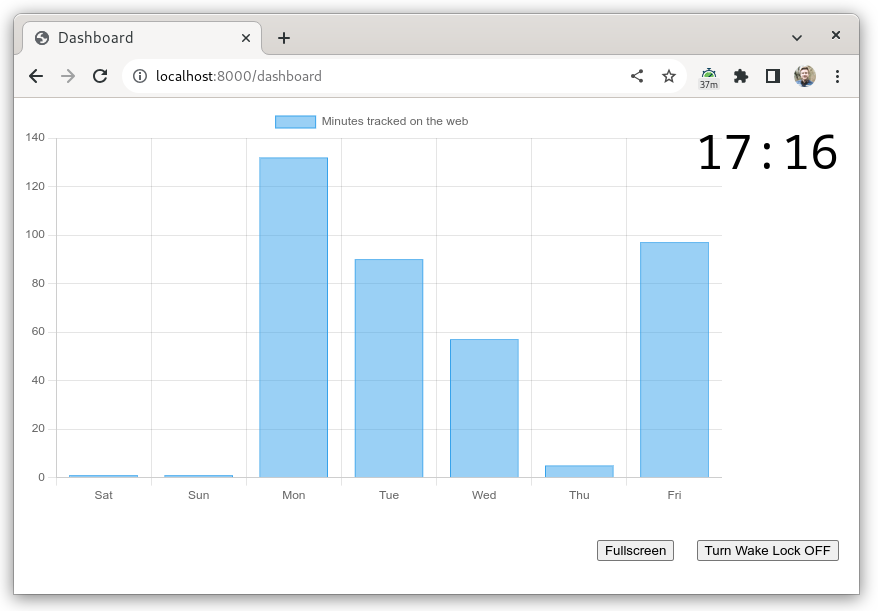

# Gaugeme — Your Personal Metrics Ingested & Visualized

Gaugeme is a server that loads metrics from various sources such as your browser.
It then visualizes these metrics on a dashboard in real-time.
This helps you track Key Performance Indicators (KPIs) of your life, such as time spent on unproductive websites.

The dashboard is accessed using a web browser for easy display on a tablet or TV:



Gaugeme is based on a pluggable architecture. You can write your own metric endpoints and visualizations.

## Getting Started

Host requirements:
* python3
* openssl
* docker

```bash
# 1. Generate `certs/` folder containing a self-signed CA, client, and server
# certificate
./scripts/generate-certs certs/

# 2. Build the Docker image
docker build . -t gaugeme

# 3. Run Gaugeme behind HTTPS using the generated server certificate. We use
# `config.example.yaml` as the configuration file.
docker run \
    --volume $(pwd)/certs/ca.public.pem:/root/.config/gaugeme/certs/ca.public.pem \
    --volume $(pwd)/certs/server.private.pem:/root/.config/gaugeme/certs/server.private.pem \
    --volume $(pwd)/certs/server.public.pem:/root/.config/gaugeme/certs/server.public.pem \
    --volume $(pwd)/config.example.yaml:/root/.config/gaugeme/config.yaml \
    --publish 44300:443 \
    --name gaugeme \
    gaugeme

# 4. Load the generated client certificate certs/client.gaugeme.pfx into your
# browser

# 5. Open https://localhost:44300/dashboard in your browser
```

## Security: Built-in TLS management and Proxy

Gaugeme is built to be exposable over the internet.
This way, the Gaugeme server, metric sources, and the device showing the dashboard doesn't need to be on the same network.
To do this safely, web clients must present a TLS client certificate when connecting to the server.
This makes the connection similarly safe to an SSH or VPN connection, where the client authenticates using a private key.

TLS connections are terminated by an Nginx web server running inside the Docker container.
For ease of use, the `./scripts/generate-certs` script can generate all certificates automatically.
